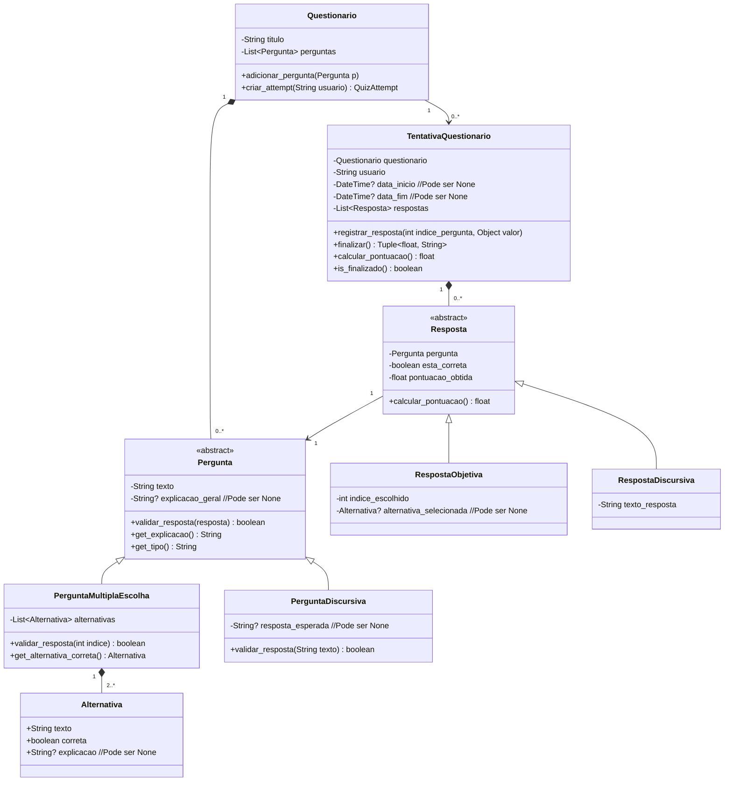

# Guia 3 — Sistema de Quiz

## Contexto

Você faz parte da equipe responsável por desenvolver um **Sistema de Quiz** educativo.

O sistema deve permitir a criação de quizzes (questionários) com perguntas de múltipla escolha ou discursivas, validação de respostas e cálculo de pontuação.

O projeto já possui a estrutura de pastas definidas. Sua missão é **implementar/completar** as classes seguindo o **diagrama UML** e as regras abaixo, passando em todos os testes.

---

## Diagrama UML



---

## Descrição das Classes

### Pergunta (Classe Abstrata)

Classe base para todas as perguntas do sistema.

Atributos:
- texto: String — Enunciado da pergunta.
- explicacao_geral: String? (opcional) — Texto explicativo mostrado após a correção.

Métodos:
- validar_resposta(resposta) → boolean — Valida a resposta (implementado nas subclasses).
- get_explicacao() → String — Retorna a explicação geral.
- get_tipo() → String — Retorna o tipo ("multipla_escolha" ou "discursiva").

### PerguntaMultiplaEscolha

Herda de Pergunta. Perguntas com alternativas.

Atributos:
- alternativas: List[Alternativa] — Lista de alternativas.

Métodos:
- validar_resposta(int indice) → boolean — Valida o índice escolhido.
- get_alternativa_correta() → Alternativa — Retorna a alternativa correta.

### PerguntaDiscursiva

Herda de Pergunta. Perguntas com resposta em texto livre.

Atributos:
- resposta_esperada: String? (opcional) — Resposta considerada correta.
- case_sensitive: boolean — Diferencia maiúsculas/minúsculas.

Métodos:
- validar_resposta(String texto) → boolean — Compara texto do usuário.

### Alternativa

Representa uma opção em perguntas de múltipla escolha.

Atributos:
- texto: String — Texto da alternativa.
- correta: boolean — Indica se é correta.
- explicacao: String? (opcional) — Explicação da alternativa.

### Resposta (Classe Abstrata)

Classe base para respostas dadas pelo usuário.

Atributos:
- pergunta: Pergunta — Pergunta respondida.
- esta_correta: boolean — Se a resposta está correta.
- pontuacao_obtida: float — Pontuação obtida.

Métodos:
- calcular_pontuacao() → float — Calcula pontuação.

### RespostaObjetiva

Herda de Resposta. Para perguntas de múltipla escolha.

Atributos:
- indice_escolhido: int — Índice escolhido.
- alternativa_selecionada: Alternativa? (opcional)

### RespostaDiscursiva

Herda de Resposta. Para perguntas discursivas.

Atributos:
- texto_resposta: String — Texto digitado pelo usuário.

### Quiz

Modelo/template do quiz (criado uma vez).

Atributos:
- titulo: String — Título do quiz.
- perguntas: List[Pergunta] — Lista de perguntas.

Métodos:
- adicionar_pergunta(Pergunta p)
- criar_attempt(String usuario) → QuizAttempt

### QuizAttempt

Representa uma tentativa de responder o quiz.

Atributos:
- quiz: Quiz — Quiz original.
- usuario: String — Usuário.
- data_inicio: DateTime?
- data_fim: DateTime?
- respostas: List[Resposta]

Métodos:
- registrar_resposta(int indice_pergunta, Object valor)
- finalizar() → (float, String)
- calcular_pontuacao() → float
- is_finalizado() → boolean

---

## Como prepara o ambiente e rodar os testes? 

#### 1. Criar ambiente virutal

Na pasta do projeto ..\Guia3> executar o comando:

```bash
python -m venv .venv
```

#### 2. Ativar Ambiente Virtual

Isso garante que qualquer modificação precise ser feita, seja realizada em um Ambiente Virtual controlado e não produza conflitos entre pacotes de outros projetos.

PowerShell do Windows:
```bash
.\.venv\Scripts\activate
```
macOS / Linux:
```bash
source .venv/bin/activate
```
#### 3. Instalar dependências

Na pasta do projeto ..\Guia3> executar o comando:

```bash
pip install -r requirements.txt
```

#### Rodar exemplo

Na pasta do projeto ..\Guia3> executar o comando:

```bash
python main.py
```

#### Rodar testes

Na pasta do projeto ..\Guia3> executar o comando:

bash
```
pytest -v
```

ou

bash
```
python -m pytest -v
```